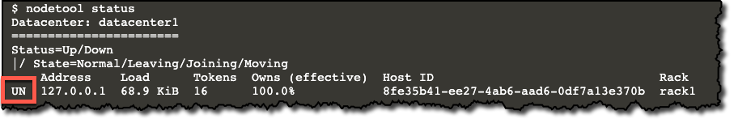

In this step, you will verify that Cassandra has been installed and is running as a service.
Next, you will connect using *cqlsh* and create a keyspace and table.

During startup, this scenario uses *apt-get* to install and start a single Cassandra node running as a service.
This process may take a few minutes. Wait until you see `Cassandra has started!` before you continue.

Once Cassandra has started, click to verify the cluster status with *nodetool*.
```
nodetool status
```{{execute}}

---
<p>
<span style="color:teal">**Status:**</span> 
Look at the first two characters of the status. 
Each character has an individual meaning. 
The sequence `UN` means the node's status is `Up` and state is `Normal`.
</p>
---



Now that the node is running, you will create a keyspace and table.
Start the CQL Shell (*cqlsh*) so you can issue CQL commands.

```
cqlsh
```{{execute}}

Create the `music` keyspace.

```
create KEYSPACE music WITH replication = {'class': 'SimpleStrategy', 'replication_factor': 1};
```{{execute}}

Use the `music` keyspace.

```
use music;
```{{execute}}

Create the `songs` table.

```
CREATE TABLE songs (
   artist TEXT,
   title TEXT,
   year INT,
   PRIMARY KEY ((artist), title)
);
```{{execute}}

Type `exit` to close *cqlsh*.
```
exit
```{{execute}}

# Summary

In this step, you have verified that Cassandra is running and created the *music* keyspace and the *songs* table.