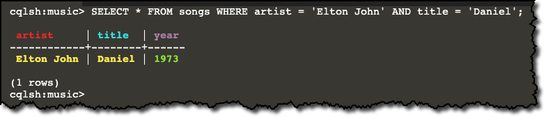
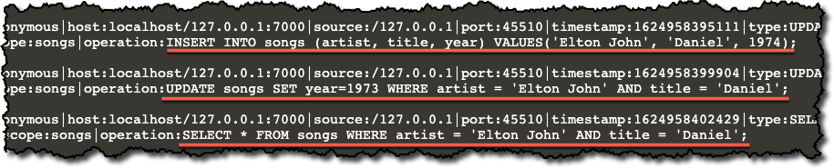

In this step you will use *nodetool* to dynamically enable audit logging. 
Next you will insert and update some data. 
Finally you will view the audit log.

Use *nodetool* to enable audit logging.
```
nodetool enableauditlog
```{{execute}}

---
<p>
<span style="color:teal">**Pro Tip:**</span> 
Settings configured with *nodetool* temporarily override settings in `cassandra.yaml`. However, settings configured with *nodetool* do not persist across shutdowns.
</p>
---

Start the CQL Shell again.

```
cqlsh
```{{execute}}

Insert a row into the *songs* table.
```
use music;
INSERT INTO songs (artist, title, year) VALUES('Elton John', 'Daniel', 1974);
```{{execute}}

Wait a minute! Elton John released *Daniel* in 1973 on the album *Don't Shoot Me I'm Only The Piano Player*!
Update the row to reflect the correct year.

```
UPDATE songs SET year=1973 WHERE artist = 'Elton John' AND title = 'Daniel';
```{{execute}}

Make sure the update worked.
```
SELECT * FROM songs WHERE artist = 'Elton John' AND title = 'Daniel';
```{{execute}}

You should see *Daniel* with the correct year - 1973.


Type `exit` to close *cqlsh*.
```
exit
```{{execute}}

The audit log is stored in binary format so you will use *auditlogviewer* to see it in *human-readable* form.
```
auditlogviewer /var/log/cassandra/audit
```{{execute}}
---
<p>
<span style="color:teal">**Note:**</span> 
Ignore any Java warnings you may see. 
The log output should contain the `INSERT`, `UPDATE` and `SELECT` commands you entered along with a timestamp, username and more.
</p>
---



Use *nodetool* to disable audit logging.
```
nodetool disableauditlog
```{{execute}}

Start *cqlsh*
```
cqlsh
```{{execute}}

Insert two songs into the *songs* table.
```
use music;
INSERT INTO songs (artist, title, year) VALUES('Elton John', 'Bennie and the Jets', 1973);
INSERT INTO songs (artist, title, year) VALUES('Steve Miller Band', 'The Joker', 1974);
```{{execute}}

Type `exit` to close *cqlsh*.
```
exit
```{{execute}}

Take another look at the audit log. Since we disabled logging the most recent inserts will not be reflected in the logs.

```
auditlogviewer /var/log/cassandra/audit
```{{execute}}