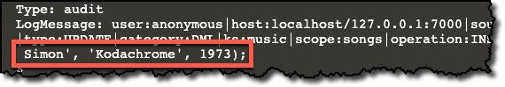

In this step you will stop the Cassandra service, enable audit logging in `cassandra.yaml`,re-start the Cassandra service, insert some data and view the inserts in the *audit log*.

---
<p>
<span style="color:teal">**Note:**</span> 
Settings in `cassandra.yaml` only take effect after a node start or re-start.
</p>
---

Stop the Cassandra service
```
service cassandra stop
```{{execute}}

Verify that Cassandra has stopped
```
nodetool status
```{{execute}}

You should see a message like this:


Click to open the `/etc/cassandra/cassandra.yaml`{{open}} file in the editor.

Add the YAML configuration to enable audit logging:
<pre class="file" data-filename="/etc/cassandra/cassandra.yaml">audit_logging_options:</pre>
<pre class="file" data-filename="/etc/cassandra/cassandra.yaml">    enabled: true</pre>

Re-start the Cassandra service
```
service cassandra start
```{{execute}}

Verify that Cassandra has started
```
nodetool status
```{{execute}}

---
<p>
<span style="color:teal">**Note:**</span> 
You may need to run `nodetool status` a few times before Cassandra has finished the startup process.
</p>
---

Next you will insert another song and verify that the insertion shows up in the audit logs.

Open cqlsh
```
cqlsh
```{{execute}}


Insert another song into the *songs* table.
```
use music;
INSERT INTO songs (artist, title, year) VALUES('Paul Simon', 'Kodachrome', 1973);
```{{execute}}

Type `exit` to close *cqlsh*.
```
exit
```{{execute}}

View the audit logs.
```
auditlogviewer /var/log/cassandra/audit
```{{execute}}

You should now see that Paul Simon's *Kodachrome* has been inserted.

