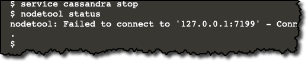

In this step you will stop the Cassandra service, enable audit logging in `cassandra.yaml`,re-start the Cassandra service, insert some data and view the inserts in the *audit log*.

---
<p>
<span style="color:teal">**Note:**</span> 
Settings in `cassandra.yaml` only take effect after a node start or re-start.
</p>
---

Stop the Cassandra service
```
service cassandra stop
```{{execute}}

Verify that Cassandra has stopped
```
nodetool status
```{{execute}}

You should see a message like this:


Click to open the `/etc/cassandra/cassandra.yaml`{{open}} file in the editor.

<pre class="file" data-filename="/etc/cassandra/cassandra.yaml">**** inserted ****</pre>
